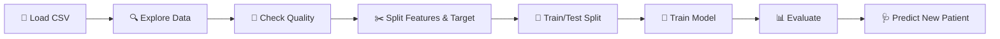

<div align="center">

# ❤️ Heart Disease Prediction

### Can a machine learning model spot a heart problem from 13 basic medical measurements?


</div>

---

## 📌 TL;DR

| | |
|---|---|
| **Goal** | Predict whether a patient has a **healthy (0)** or **defective (1)** heart |
| **Data** | 303 patients · 13 medical features · 0 missing values |
| **Model** | Logistic Regression |
| **Test accuracy** | **80.3%** on patients the model had never seen |
| **Bonus** | A mini *predictive system*: enter one patient's values, get an instant answer |

> 🌱 This was one of my **first ML projects**. I built it to learn the complete machine learning workflow from raw CSV to a working prediction.

---

## 🔄 What I Did, End to End



### 1️⃣ Understood the data
Loaded the dataset with Pandas and looked at it from every angle: `head()`, `tail()`, `shape`, `info()` and `describe()`.
Found **303 rows and 14 columns**, all numeric.

### 2️⃣ Checked data quality
Ran `isnull().sum()`: **zero missing values**, so no imputation was needed.

### 3️⃣ Checked the target balance
The two classes are close to even, so accuracy is a fair starting metric.

| Class | Meaning | Patients | Share |
|---|---|---|---|
| `1` | Defective heart | 165 | 54% |
| `0` | Healthy heart | 138 | 46% |

### 4️⃣ Separated features and label
```python
x = heart_data.drop(columns='target', axis=1)   # 13 input features
y = heart_data['target']                        # what we want to predict
```

### 5️⃣ Split into train and test sets
80% to learn from, 20% kept hidden for honest testing. I used `stratify=y` so both sets keep the same healthy/defective ratio.
```python
x_train, x_test, y_train, y_test = train_test_split(
    x, y, test_size=0.2, stratify=y, random_state=42
)
```

### 6️⃣ Trained the model
```python
model = LogisticRegression()
model.fit(x_train, y_train)
```

### 7️⃣ Evaluated it

| Dataset | Accuracy |
|:---|:---:|
| 🏋️ Training data | **83.9%** |
| 🧪 Test data (unseen) | **80.3%** |

The gap between the two is small (about 3.6 points), which tells me the model is **learning real patterns instead of just memorising** the training data.

### 8️⃣ Built a predictive system 🩺
Wrote a small function that takes one patient's 13 values and prints the result:

```python
input_data = (56, 1, 1, 120, 236, 0, 1, 178, 0, 0.8, 2, 0, 2)
# → Defective Heart
```

---

## 🧬 The 13 Features Used

<details>
<summary><b>Click to expand the feature guide</b></summary>

<br>

| Feature | Meaning |
|---|---|
| `age` | Age in years |
| `sex` | 1 = male, 0 = female |
| `cp` | Chest pain type |
| `trestbps` | Resting blood pressure (mm Hg) |
| `chol` | Serum cholesterol (mg/dl) |
| `fbs` | Fasting blood sugar > 120 mg/dl (1 = yes, 0 = no) |
| `restecg` | Resting ECG result |
| `thalach` | Maximum heart rate achieved |
| `exang` | Exercise-induced angina (1 = yes, 0 = no) |
| `oldpeak` | ST depression induced by exercise |
| `slope` | Slope of the peak exercise ST segment |
| `ca` | Number of major vessels (0 to 3) |
| `thal` | Thalassemia result |

</details>

---

## 🎓 What I Learned

- The full ML pipeline: **load → explore → clean → split → train → evaluate → predict**
- Why we keep a **test set** and why **stratified splitting** matters
- How to read **training vs test accuracy** to spot overfitting
- How to turn a trained model into a simple **prediction tool**

## 🚀 What I'd Improve Next

This is a first-version project, and I know where it can grow:

- [ ] Add **recall, precision, F1 and a confusion matrix**. In healthcare, missing a sick patient is the costly mistake, so recall matters more than accuracy.
- [ ] Add **ROC-AUC** and an ROC curve
- [ ] **Scale the features** (`StandardScaler`) and fix the convergence warning
- [ ] Compare with **Random Forest, SVM, KNN, XGBoost** using cross-validation
- [ ] Add **EDA charts** (correlation heatmap, feature distributions) and feature importance

---

## 📁 Project Structure

```
heart-disease-prediction/
├── README.md                  # you are here
├── main.ipynb                 # full notebook: EDA → model → prediction
├── heart_disease_data.csv     # dataset (303 rows × 14 columns)
└── requirements.txt           # Python dependencies
```

## ▶️ Run It Yourself

```bash
# 1. Clone the repo
git clone https://github.com/aditya-datahub/healthcare-ml-predictions.git
cd healthcare-ml-predictions/heart-disease-prediction

# 2. Install dependencies
pip install -r requirements.txt

# 3. Open the notebook
jupyter notebook main.ipynb
```

---

> ⚠️ **Disclaimer:** This is a learning project, not a medical tool. Do not use it for real diagnosis.

<div align="center">

**Built by [Aditya Sharma](https://github.com/aditya-datahub)** · [LinkedIn](https://www.linkedin.com/in/aditya-sharma-data-analyst)

⭐ If you found this useful, consider starring the repo!

</div>
